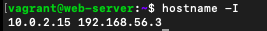
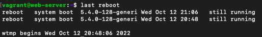

# 10 Linux Commands

## The "ps" command

Linux provides us a utility called ps for viewing information related with the processes on a system which stands as abbreviation for “Process Status”. It is a command line utility that is used to *display or view information related to the processes running in a Linux system*.

**ps command without arguments**
- The ps command without arguments lists the running processes in the current shell


for example:

 ```$ ps```

output:


The output consists of four columns 
- **PID** - This is the unique process ID
- **TTY** - This is the typeof terminal that the user is logged in to
- **TIME** - This is the time in minutes and seconds that the process has been running
- **CMD** - The command that launched the process
  
## The "wget" command

Wget is a free command-line utility and network file downloader, which comes with many features that make file downloads easy, including:

- Download large files or mirror complete web or FTP sites.
- Download multiple files at once.
- Set bandwidth and speed limit for downloads.
- Download files through proxies.
- Can resume aborted downloads.
- Recursively mirror directories.
- Runs on most UNIX-like operating systems as well as Windows.
- Unattended / background operation.
- Support for persistent HTTP connections.
- Support for SSL/TLS for encrypted downloads using the OpenSSL or GnuTLS library.
- Support for IPv4 and IPv6 downloads.

The basic syntax of **Wget** is:

```$ wget [option] [URL]```


- **options** - The [Wget options](https://linux.die.net/man/1/wget)
- **url** - URL of the file or directory you want to download or synchronize.


**Download a File with Wget**

The command will download a single file and store it in a current directory. It also shows download progress, size, date, and time while downloading.

For example: to download the latest version of WordPress

`wget https://wordpress.org/latest.zip`

output:


## The "cal" command

The cal command is a calendar command in Linux which is used to see the calendar of a specific month or a whole year.It shows current month calendar on the terminal with the current date highlighted.

for example:

`$ cal`

output:


## The "env" command

Displays all environment variables. It is also used to run a utility or command in a custom environment. In practice, env has another common use. It is often used by shell scripts to launch the correct interpreter. In this usage, the environment is typically not changed.

syntax :


env [OPTION]... [-][NAME=VALUE]... [COMMAND [ARG]...]

for example, **without any argument** : print out a list of all environment variables

`$  env`

output:


## The "finger" command

This shows information of all the users logged in. Finger command is a user information lookup command which gives details of all the users logged in. This tool is generally used by system administrators. It provides details like login name, user name, idle time, login time, and in some cases their email address even. 

*Installing finger User Information Lookup Tool*

To install finger tool use the following commands as per your Linux distribution. In case of Debian/Ubuntu:

`$sudo apt-get install finger`

***To finger or get details of a user***

`$ finger`

output:


## The "history" command
The history command keeps a list of all the other commands that have been run from that terminal session, then allows you to replay or reuse those commands instead of retyping them. 

To see history in action, open a terminal program on your Linux installation and type:

`$ history`

output: 


The history command shows a list of the commands entered since you started the session.

## The "hostname" command
This command shows system host name. A hostname is the name of any computer that is connected to a network that is uniquely identified over a network. It can be accessed without using a particular IP address.

This command is most commonly used for checking the hostname of your Linux system by running it in the manner shown below:

`$ hostname`


output:


## The "hostname I" command

Displays all local IP addresses of the host.


`$ hostname I`


output:





## The "ip a" command

The ip command is a Linux net-tool for system and network administrators. IP stands for Internet Protocol and as the name suggests, the tool is used for configuring network interfaces.

**ip a** displays all devices by using the following command. 

for example:


`ip a`

output:


Displays all network interfaces and IP addresses.


## The "last reboot" command

Shows system reboot history.

for example:


`$ last reboot`

output:





