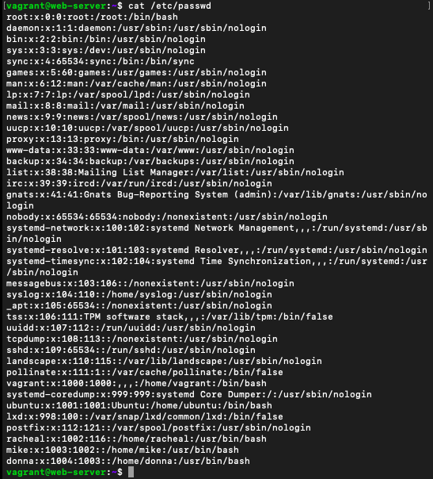
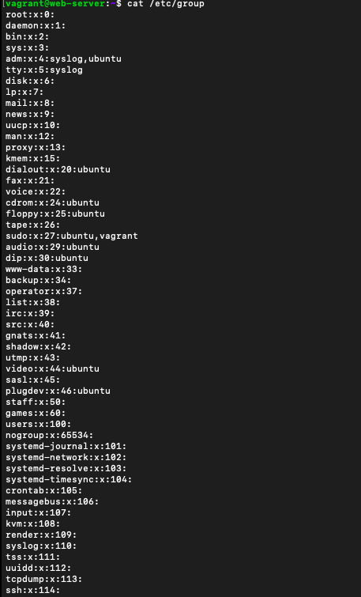
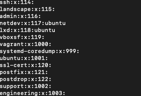
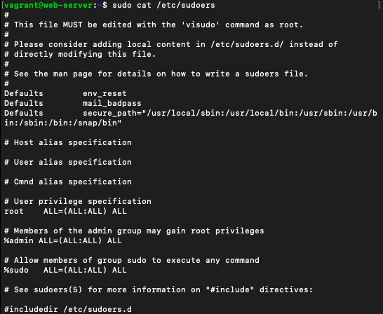

# Exercise

- Create 3 groups – admin, support & engineering and add the admin group to sudoers. 
- Create a user in each of the groups. 
- Generate SSH keys for the user in the admin group

Below are the content of **/etc/passwd**, **/etc/group** and **/etc/sudoers**:

## /etc/passwd

Traditionally, the **/etc/passwd** file is used to keep track of every registered user that has access to a system.

The ```/etc/passwd``` file is a colon-separated file that contains the following information:
User name
Encrypted password
User ID number (UID)
User's group ID number (GID)
Full name of the user (GECOS)
User home directory
Login shell

Below are the contents of the /etc/passwd file:




## /etc/group

The ```/etc/group``` is a text file which defines the groups to which users belong under Linux and UNIX operating system. The use of groups allows additional abilities to be delegated in an organized fashion, such as access to disks, printers, and other peripherals. This method, amongst others, also enables the Superuser to delegate some administrative tasks to normal users.

Below are the contents of the /etc/group file:






## /etc/sudoers

The ```/etc/sudoers``` file controls who can run what commands as what users on what machines and can also control special things such as whether you need a password for particular commands. The file is composed of aliases (basically variables) and user specifications (which control who can run what).

Below are the contents of the /etc/sudoers file:



