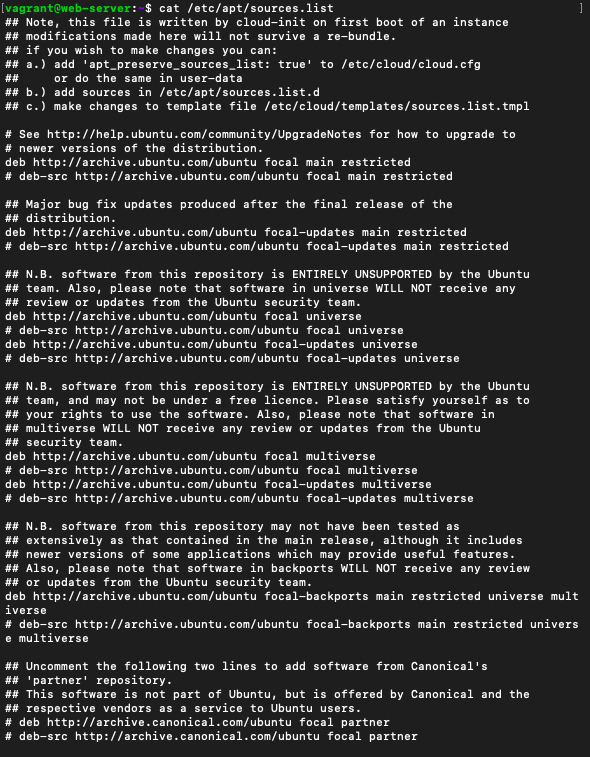
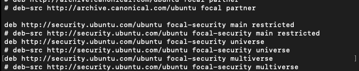

## The content of /etc/apt/source

Upfront, the /etc/apt/source.list is a configuration file for Linux's Advance Packaging Tool, that holds URLs and other information for remote repositories from where software packages and applications are installed.

```cat /etc/apt/source```

I received something similar to the following:







## The php -v command

The php -v command is to check the version of php installed:

```php -v```

I received something similar to the following:


