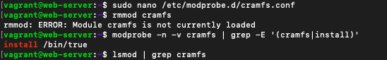

# solutions

## Ensure mounting of cramfs filesystems is disabled (Automated)
Profile Applicability:
- Level 1 - Server
- Level 1 - Workstation

Description:
The cramfs filesystem type is a compressed read-only Linux filesystem embedded in small footprint systems. A cramfs image can be used without having to first decompress the image.

Rationale:
Removing support for unneeded filesystem types reduces the local attack surface of the server. If this filesystem type is not needed, disable it.

Audit:
Run the following commands and verify the output is as indicated:

Profile Applicability:
- Level 1 - Server
- Level 1 - Workstation

Description:
The freevxfs filesystem type is a free version of the Veritas type filesystem. This is the primary filesystem type for HP-UX operating systems.

Rationale:
Removing support for unneeded filesystem types reduces the local attack surface of the system. If this filesystem type is not needed, disable it.

Audit:
Run the following commands and verify the output is as indicated:

Profile Applicability:
- Level 1 - Server
- Level 1 - Workstation

Description:
The jffs2 (journaling flash filesystem 2) filesystem type is a log-structured filesystem used in flash memory devices.
Rationale:
Removing support for unneeded filesystem types reduces the local attack surface of the system. If this filesystem type is not needed, disable it.
Audit:
Run the following commands and verify the output is as indicated:

Profile Applicability:
- Level 1 - Server
- Level 1 - Workstation

Description:
The hfs filesystem type is a hierarchical filesystem that allows you to mount Mac OS filesystems.

Rationale:
Removing support for unneeded filesystem types reduces the local attack surface of the system. If this filesystem type is not needed, disable it.

Audit:
Run the following commands and verify the output is as indicated:

Profile Applicability:
- Level 1 - Server
- Level 1 - Workstation

Description:
The hfsplus filesystem type is a hierarchical filesystem designed to replace hfs that allows you to mount Mac OS filesystems.

Rationale:
Removing support for unneeded filesystem types reduces the local attack surface of the system. If this filesystem type is not needed, disable it.

Audit:
Run the following commands and verify the output is as indicated:

Profile Applicability:
- Level 1 - Server
- Level 1 - Workstation

Description:
The udf filesystem type is the universal disk format used to implement ISO/IEC 13346 and ECMA-167 specifications. This is an open vendor filesystem type for data storage on a broad range of media. This filesystem type is necessary to support writing DVDs and newer optical disc formats.

Rationale:
Removing support for unneeded filesystem types reduces the local attack surface of the system. If this filesystem type is not needed, disable it.

Audit:
Run the following commands and verify the output is as indicated:

Profile Applicability:
- Level 1 - Server
- Level 1 - Workstation

Description:
The nosuid mount option specifies that the filesystem cannot contain setuid files.

Rationale:
Since the /tmp filesystem is only intended for temporary file storage, set this option to ensure that users cannot create setuid files in /tmp .

Audit:
If a /tmp partition exists, verify that the nosuid option is set Run the following command and verify that nothing is returned:

Profile Applicability:

- Level 1 - Server
- Level 1 - Workstation

Description:
The noexec mount option specifies that the filesystem cannot contain executable binaries.

Rationale:
Since the /tmp filesystem is only intended for temporary file storage, set this option to ensure that users cannot run executable binaries from /tmp.

Audit:
If a /tmp partition exists, verify that the noexec option is set. Run the following command and verify that nothing is returned:

Profile Applicability:

- Level 1 - Server
- Level 1 - Workstation

Description:
The /tmp directory is a world-writable directory used for temporary storage by all users and some applications

Rationale:
Making /tmp its own file system allows an administrator to set the noexec option on the mount, making /tmp useless for an attacker to install executable code. It would also prevent an attacker from establishing a hardlink to a system setuid program and wait for it to be updated. Once the program was updated, the hardlink would be broken and the attacker would have his own copy of the program. If the program happened to have a security vulnerability, the attacker could continue to exploit the known flaw.
This can be accomplished by either mounting tmpfs to /tmp, or creating a separate partition for /tmp.

Impact:
Since the /tmp directory is intended to be world-writable, there is a risk of resource exhaustion if it is not bound to a separate partition.
Running out of /tmp space is a problem regardless of what kind of filesystem lies under it, but in a default installation a disk-based /tmp will essentially have the whole disk available, as it only creates a single / partition. On the other hand, a RAM-based /tmp as with tmpfs will almost certainly be much smaller, which can lead to applications filling up the filesystem much more easily.
/tmp utilizing tmpfs can be resized using the size={size} parameter on the Options line on the tmp.mount file.

Audit:
Run the following command and verify output shows /tmp is mounted to tmpfs or a system partition:

Profile Applicability:
- Level 1 - Server
- Level 1 - Workstation

Description:
The nodev mount option specifies that the filesystem cannot contain special devices.

Rationale:
Since the /tmp filesystem is not intended to support devices, set this option to ensure that users cannot attempt to create block or character special devices in /tmp .

Audit:
Verify that the nodev option is set if a /tmp partition exists
Run the following command and verify that nothing is returned:
 

