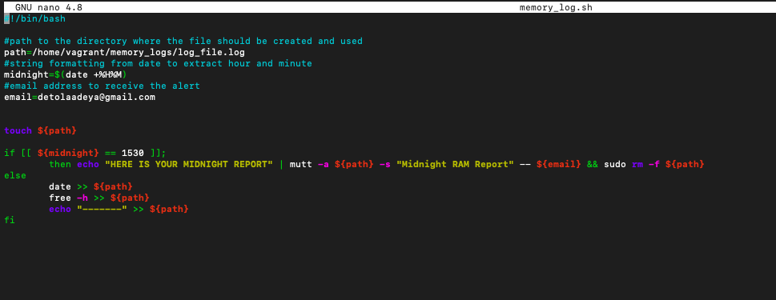
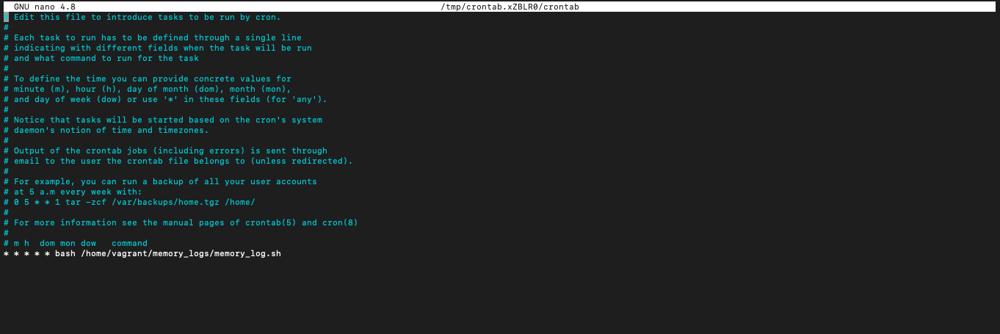
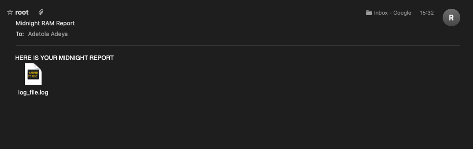

# content of script, cronjob and a sample of the email sent

## **script**
below is the bash script to automate the task.I couldn't wait till midnight to see if my script worked, so I altered the bash script to:

```If [[ ${midnight} == 0000]] to if [[ ${midnight} == 1530]]```





## **cronjob**

I scheduled a cronjob for timely execution of the bash script. I couldn't wait till midnight to see if my script worked, so I altered the crontab to:

```* * * * * bash /home/vagrant/memory_logs/memory_log.sh```



## **email**

This is a screenshot of the report sent through email.


